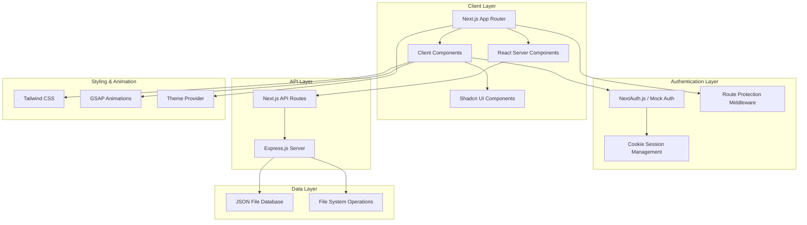

# Design Document: E-Commerce Platform

## Overview

The e-commerce platform is a modern Next.js 15 application that provides a comprehensive shopping experience with authentication, product browsing, and item management. The system leverages the App Router architecture for optimal performance and uses a JSON file-based data storage approach for simplicity while maintaining full CRUD functionality.

The platform emphasizes user experience through modern UI components (Shadcn UI), responsive design (Tailwind CSS), smooth animations (GSAP), and flexible theming (light/dark modes). Authentication is handled through both mock credentials and optional NextAuth.js integration for social login.

## Architecture

### High-Level Architecture



### Technology Stack

- **Frontend Framework**: Next.js 15 with App Router
- **UI Components**: Shadcn UI with Tailwind CSS
- **Authentication**: NextAuth.js (optional) + Mock authentication
- **Animations**: GSAP (GreenSock Animation Platform)
- **Styling**: Tailwind CSS with custom theme system
- **Backend API**: Express.js server
- **Data Storage**: JSON file-based database
- **Session Management**: HTTP-only cookies

## Components and Interfaces

### Core Components

#### 1. Layout Components

**RootLayout Component**

- Provides global layout structure with theme provider
- Manages dark/light theme state and persistence
- Includes global navigation and footer
- Integrates GSAP animation context

**Navbar Component**

- Responsive navigation with theme toggle
- Authentication-aware menu items
- Smooth animations for menu interactions
- Mobile-responsive hamburger menu

**Footer Component**

- Static footer with company information
- Responsive design across all screen sizes

#### 2. Authentication Components

**LoginForm Component**

- Handles both mock and NextAuth.js authentication
- Form validation with Shadcn UI form components
- Loading states with animated feedback
- Error handling with toast notifications

**AuthProvider Component**

- Wraps application with authentication context
- Manages session state and user information
- Provides authentication utilities to child components

#### 3. Product Components

**ItemCard Component**

- Displays product information in card format
- Hover animations using GSAP
- Responsive image handling
- Click navigation to detail pages

**ItemList Component**

- Grid layout for product cards
- Loading states with skeleton components
- Empty state handling
- Pagination support (future enhancement)

**ItemDetails Component**

- Full product information display
- Image gallery with animations
- Add to cart functionality (if implemented)
- Breadcrumb navigation

**AddItemForm Component** (Protected)

- Form for creating new products
- File upload for product images
- Form validation and error handling
- Success feedback with animations

#### 4. UI Enhancement Components

**ThemeProvider Component**

- Manages light/dark theme switching
- Persists theme preference in localStorage
- Provides theme context to all components

**AnimationWrapper Component**

- GSAP animation utilities
- Page transition animations
- Scroll-triggered animations
- Performance-optimized animation management

### API Interfaces

#### Authentication Endpoints

```javascript
// Mock Authentication
POST /api/auth/login
{
  email: "string",
  password: "string"
}
Response: { success: boolean, user?: User, error?: string }

POST /api/auth/logout
Response: { success: boolean }

GET /api/auth/session
Response: { user?: User, authenticated: boolean }
```

#### Product Management Endpoints

```javascript
// Items API
GET /api/items
Response: { items: Item[], total: number }

GET /api/items/[id]
Response: { item: Item } | { error: string }

POST /api/items (Protected)
{
  name: "string",
  description: "string",
  price: "number",
  image?: "string"
}
Response: { item: Item, success: boolean } | { error: string }

PUT /api/items/[id] (Protected)
{
  name?: "string",
  description?: "string",
  price?: "number",
  image?: "string"
}
Response: { item: Item, success: boolean } | { error: string }

DELETE /api/items/[id] (Protected)
Response: { success: boolean } | { error: string }
```

## Data Models

### User Model

```javascript
// User object structure
const User = {
  id: 'string',
  email: 'string',
  name: 'string', // optional
  image: 'string', // optional
  role: 'user' | 'admin',
  createdAt: 'Date',
  updatedAt: 'Date',
};
```

### Item Model

```javascript
// Item object structure
const Item = {
  id: 'string',
  name: 'string',
  description: 'string',
  price: 'number',
  image: 'string', // optional
  category: 'string', // optional
  inStock: 'boolean',
  createdAt: 'Date',
  updatedAt: 'Date',
  createdBy: 'string', // User ID, optional
};
```

### Session Model

```javascript
// Session object structure
const Session = {
  user: 'User object',
  expires: 'Date',
  sessionToken: 'string',
};
```

### JSON Database Structure

```javascript
// Database file structure
const Database = {
  users: [], // Array of User objects
  items: [], // Array of Item objects
  sessions: [], // Array of Session objects
  metadata: {
    version: 'string',
    lastUpdated: 'Date',
  },
};
```

## Correctness Properties

_A property is a characteristic or behavior that should hold true across all valid executions of a system-essentially, a formal statement about what the system should do. Properties serve as the bridge between human-readable specifications and machine-verifiable correctness guarantees._

### Property-Based Testing Properties

Based on the prework analysis and property reflection, the following properties will validate the system's correctness:

**Property 1: Route Protection Consistency**
_For any_ protected route in the system, when accessed by an unauthenticated user, the system should redirect to the login page
**Validates: Requirements 2.4, 2.7, 5.2**

**Property 2: Authentication Session Persistence**
_For any_ authenticated user session, refreshing the page or navigating between pages should maintain the authentication state
**Validates: Requirements 2.6**

**Property 3: Item Display Completeness**
_For any_ item in the system, when displayed as a card or in detail view, all required fields (name, description, price, image) should be present in the rendered output
**Validates: Requirements 3.3, 4.2**

**Property 4: Item Navigation Consistency**
_For any_ item card displayed in the list, clicking on it should navigate to the corresponding item detail page with the correct item ID
**Validates: Requirements 3.6**

**Property 5: API Data Persistence**
_For any_ valid item created through the API, the item should be retrievable through subsequent API calls and persist in the JSON database
**Validates: Requirements 5.4, 6.3**

**Property 6: Form Validation Enforcement**
_For any_ form submission with missing required fields, the system should prevent submission and display appropriate validation errors
**Validates: Requirements 5.7**

**Property 7: Success Feedback Consistency**
_For any_ successful user action (item creation, authentication, etc.), the system should provide immediate visual feedback through toast notifications or UI updates
**Validates: Requirements 5.5, 8.2**

**Property 8: Theme System Consistency**
_For any_ theme change (light to dark or vice versa), all pages and components should reflect the new theme immediately and the preference should persist across sessions
**Validates: Requirements 7.3, 7.4, 7.7**

**Property 9: JSON Database Integrity**
_For any_ sequence of CRUD operations on the JSON database, the data should remain consistent and accessible across server restarts
**Validates: Requirements 6.6**

**Property 10: Concurrent Access Safety**
_For any_ set of simultaneous API operations on the same data, the final state should be consistent and no data should be lost or corrupted
**Validates: Requirements 6.7**

**Property 11: Loading State Visibility**
_For any_ asynchronous operation (API calls, page loads), appropriate loading indicators should be displayed until the operation completes
**Validates: Requirements 8.5**

## Error Handling

### Client-Side Error Handling

**Authentication Errors**

- Invalid credentials: Display user-friendly error message
- Session expiration: Redirect to login with notification
- Network errors: Retry mechanism with exponential backoff

**API Communication Errors**

- Network failures: Display offline indicator and retry options
- Server errors (5xx): Generic error message with support contact
- Client errors (4xx): Specific error messages based on error type
- Timeout errors: Retry with loading indicator

**Form Validation Errors**

- Real-time validation feedback using Shadcn UI form components
- Field-level error messages with clear guidance
- Prevent submission until all validation passes
- Accessibility-compliant error announcements

### Server-Side Error Handling

**JSON Database Errors**

- File system errors: Graceful degradation with error logging
- Concurrent access conflicts: Retry mechanism with file locking
- Data corruption: Backup restoration with user notification
- Disk space issues: Alert administrators and prevent new writes

**API Endpoint Errors**

- Malformed requests: Return 400 with detailed error messages
- Authentication failures: Return 401 with clear instructions
- Authorization failures: Return 403 with appropriate messaging
- Resource not found: Return 404 with helpful suggestions
- Server errors: Return 500 with generic message and error logging

### Error Recovery Strategies

**Graceful Degradation**

- Offline functionality where possible
- Cached data display when API is unavailable
- Progressive enhancement for non-critical features

**User Communication**

- Toast notifications for temporary errors
- Modal dialogs for critical errors requiring user action
- Status pages for system-wide issues
- Clear recovery instructions for user errors

## Testing Strategy

### Dual Testing Approach

The system will employ both unit testing and property-based testing to ensure comprehensive coverage:

**Unit Tests**

- Specific examples and edge cases
- Component rendering and interaction testing
- API endpoint functionality verification
- Authentication flow testing
- Error condition handling

**Property-Based Tests**

- Universal properties across all inputs
- Comprehensive input coverage through randomization
- Correctness validation for business logic
- Data integrity verification
- System behavior consistency

### Property-Based Testing Configuration

**Testing Framework**: Fast-check (for JavaScript)

- Minimum 100 iterations per property test
- Each test tagged with: **Feature: e-commerce-platform, Property {number}: {property_text}**
- Custom generators for User, Item, and Session data types
- Shrinking enabled for minimal counterexample discovery

**Unit Testing Framework**: Jest with React Testing Library

- Component testing with user interaction simulation
- API route testing with mock data
- Authentication middleware testing
- Form validation testing

### Test Data Management

**Mock Data Generation**

- Realistic user profiles with various roles
- Diverse item catalogs with different categories and price ranges
- Session data with various expiration states
- Error scenarios for comprehensive edge case coverage

**Test Environment Setup**

- Isolated JSON database files for testing
- Mock authentication providers
- Controlled animation environments
- Theme testing across light/dark modes

### Performance Testing

**Animation Performance**

- GSAP animation frame rate monitoring
- Memory usage tracking during animations
- Accessibility compliance verification
- Mobile device performance validation

**API Performance**

- Response time measurement for all endpoints
- Concurrent request handling verification
- JSON file I/O performance monitoring
- Memory usage during large data operations

### Integration Testing

**End-to-End Workflows**

- Complete user journey from landing to item creation
- Authentication flow testing across different providers
- Theme switching across multiple pages
- Error recovery and retry mechanisms

**Cross-Browser Testing**

- Modern browser compatibility verification
- Mobile responsiveness validation
- Animation consistency across platforms
- Theme rendering consistency
